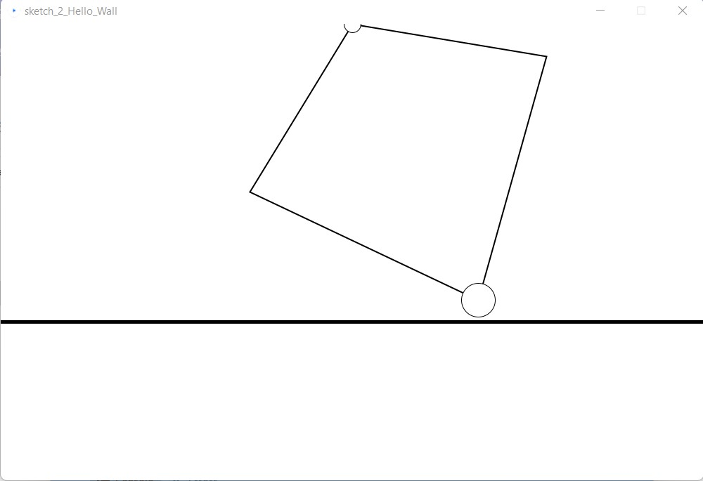
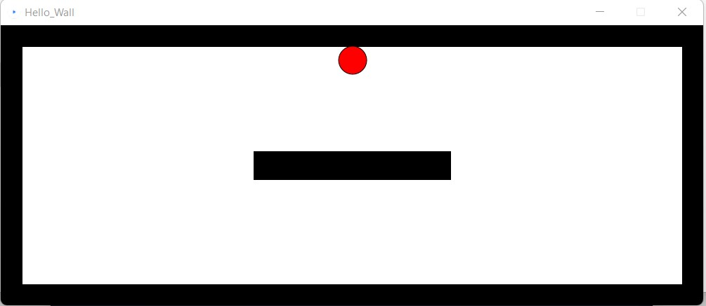
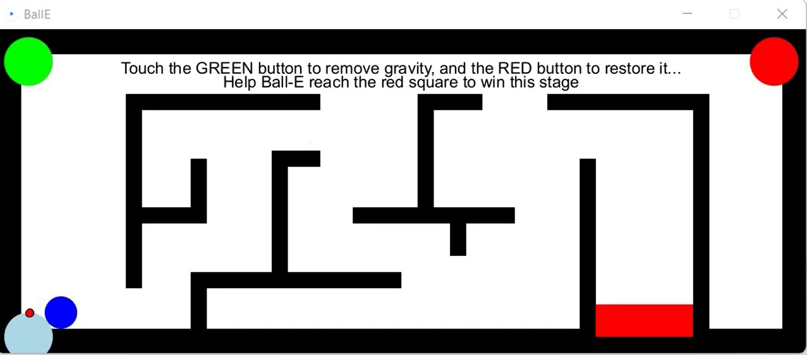
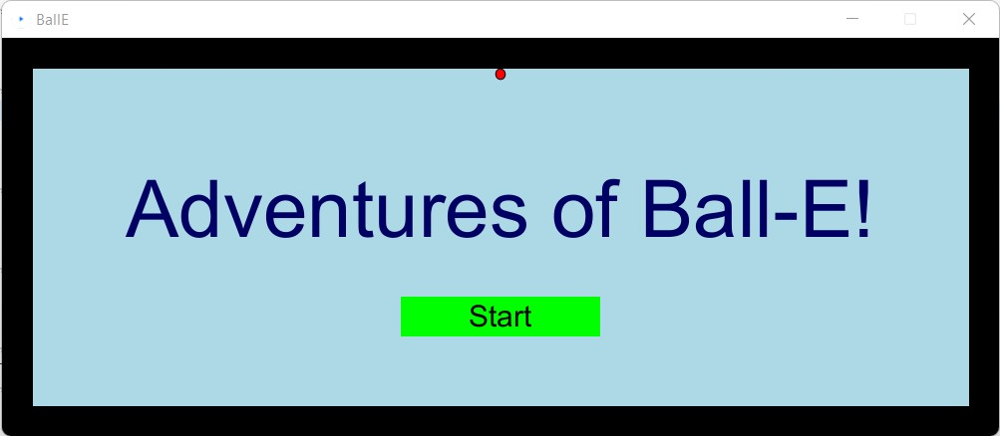
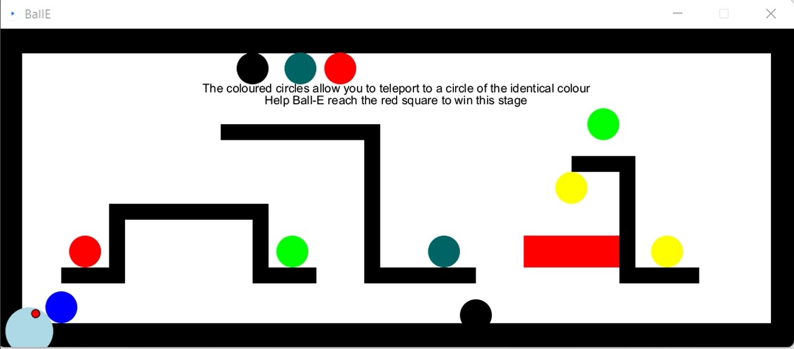

### Introduction
This blog covers my experience with setting up the Haply device, running the example code and designing my own maze to work with the device.

### Setting up
The initial set up was fairly easy given the lecture video recording and the detailed write up on the 'How-To: Haply' page. My only challenge here was finding the right 'Hello Wall' example: the minimal one on the Haply site or the more aesthetic one in the github repository. Since they both serve essentially the same purpose, however, this was just a minor hiccup. 

I also tried out the other examples on the Haply website, and played around with the shapes and other parameters just to figure out what was happening. I was quite drawn in by the modified fisica library examples and given it's fairly detailed documentation, I decided too use it for building my maze.

### Designing the maze
As I was playing with the Maze(Fisica) example and becoming increasingly frustrated with the square slipping of as I tried to lift it over the obstacle, I just knew what I wanted to do for my maze.
Instead of making an ordinary maze, I decided to add in the feature to activate and deactivate gravity- this would make things easier for the user and yet somewhat different and exciting (at least, in my opinion).  

Ironically, the Maze(Fisica) example code was the first thing I looked at for inspiration on how to implement this. The buttons implemented there made things much simpler to get started and I used a similar format in my layout, making modification to enable a gravity change when they were activated. I also added in an 'Info/Help' button to help the user access the instructions on how things worked. 

Then, after painstakingly implementing a maze using polygons on Processing, while also making sure I left enough gaps at the top to allow easy access to the buttons, I had my maze (or the first part of it!).

I also decided to wrap up the whole thing into a game like format.

<video height="100%" controls>
  <source src="../assets/images/labs/lab2/BallE_Scene1.mp4" type="video/mp4">
</video>

By this point, I was enjoying myself a fair bit and decided to also implement a second level- a maze of sorts with teleportation.
This involved making multiple buttons of the kind I had for the gravity level and triggering them when the ball touched them. I indicated the point the ball would reappear by a similar colour button but realized that this could get confusing- which was the entry and exit point. I had a few design options I considered:
- Make the entry and exit buttons look different- but this would need a longer explanation to the user.
- Make both sides entry and exit point- but this would result in an endless loop unless I introduced a delay to triggering in some way or shifted the teleport point a little away from the button.
- Make the exit points normally inaccessible- this seemed like the easiest of the three to implement and so I opted for this one. 

Now that this was done, I played the maze to test it out, and encountered by second major problem with this scene. After the initial start, or when it dropped from one of the three teleportation exits at the top, the acceleration of the ball made it reach the entry of a portal (mostly the wrong one with the way the layout is shaped) endlessly going in a loop between the portals. Again I had a few alternatives to fix this, including changing the shape of the polygons. But (having had what felt like a lifetime's worth of drawing polygons!) I went through the Fisica documentation again. This time I found setAngularDamping function for the Fisica body method which would do the job just as well as long as I damped the acceleration of the ball just enough to avoid such looping- which is exactly what I did. And with that, everything seemed to working fine.

Finally, I added in an end page as well. 

<video height="100%" controls>
  <source src="../assets/images/labs/lab2/BallE_Scene2.mp4" type="video/mp4">
</video>

### Reflections
I thoroughly enjoyed this lab, and although it took a fair bit of time (owing mainly to my own over-enthusiasm and bad decisions), I now think I feel much more confident about working with the Haply. If you want to play with Ball-E yourself you can find the code here: [Ball-E Source Code](https://github.com/VenissaCarolQuadros/CanHap501/tree/main/labs/code/lab2/BallE). It is admittedly in need of a clean up, so I hope using it as is is all you want to do.

If I could go back and do things differently, I wouldn't underestimate the effort it takes to draw a maze and would do it in a more automated way, rather than doing it manually. I would also read the Fisica library more thoroughly the first time around and save myself a whole lot of grief. 

But those are lessons for another day.

