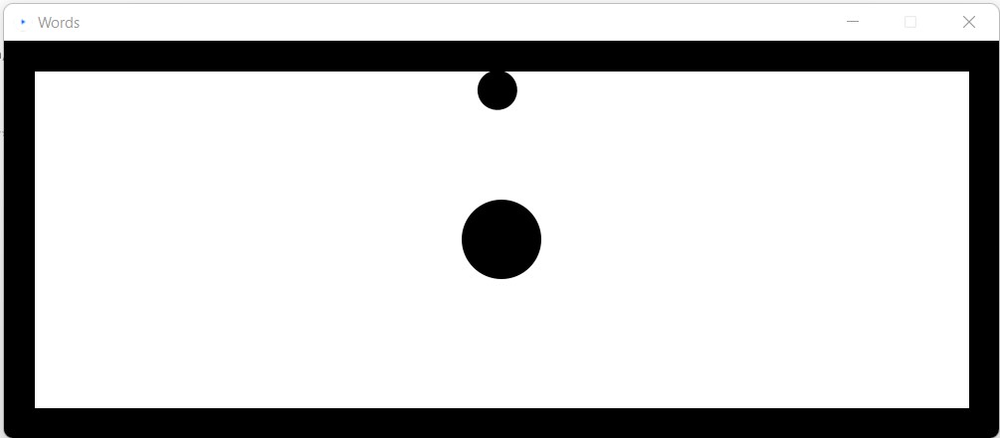
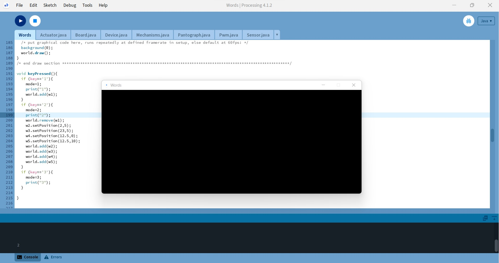

### Introduction
This assignment was quite different in that in strayed a little from the usual focus on multimodal feedback. The requirements were quite straightforward. We were required to create a set of movements to convey 3 words, use two or more different rendering features (static objects, dynamic objects, regions with different dynamics, or a motion guidance), use no other mode of feedback besides physical, link all of these into one sketch, and have someone outside our groups test it. 
Beyond this we were given free reign to implement any three words of our choice, and I was fairly excited because it meant we could do our first user test of sorts.

### What I set out to convey?
I didn't want to restrict myself to a genre of words and so to narrow down my choices I decided to use a different rendering feature for each of my words. Based on this reasoning and some mental back and forth I eventually arrived at three words:
1. Sticky 
2. Trap
3. Happy

#### 1. Sticky
To implement 'sticky' I decided to use a version of region with different dynamics. My sketch consisted of a ball at the centre of the workspace which would create a 'sticky' effect when touched and it would stop being sticky when the end effector pulls away sufficiently from the ball after such a touch- just like sticky stuff works minus the after residue. Also, the sticky feeling would only be trigerred again at a subsequent touch.

To model this effect, I created a static circle at the centre of the workspace and triggered damping on the end effector when it made contact with this circle. This damping dropped linearly to zero with increase in distance of the end effector from the initial point of contact. The trigger was reset when the damping reduced to zero after making contact- releasing the sticky effect.
        
        if (s.h_avatar.isTouchingBody(w1))
        {
            contact= w1.getContacts();
            x=contact.get(0).getX();
            y=contact.get(0).getY();
            s.h_avatar.setDamping(1100);     
            joint = true;       
        }
        if (joint)
        {
            dist=Math.abs(x-s.h_avatar.getX())+Math.abs(y-s.h_avatar.getY());
            if ((1000-250*dist)>0)
            {
                s.h_avatar.setDamping(1000-250*dist);
            }
            else 
            {
                s.h_avatar.setDamping(0.0);
                joint=false;
            }
        }

While the logic was quite straight-forward and easy to implement, it took slightly longer to tweak the magnitude of damping and the distance for trigger release. In case of the magnitude of damping, it was important to keep it high enough to be reliably felt, but not too high so a gentle user would feel like they are stuck by a solid surface or that a successful attempt to break free caused the end-effector to vibrate uncontrollably. Adjusting the trigger release distance was important to ensure that the initial contact with the sticky ball didn't result in a perpetual 'stuck' state when too high. In both cases, too low values would result in an unperceptible sticky effect. 

Thankfully, the tweaking itself wasn't hard and with some patience and a fair number of self-tests, I was able to achieve an effect I could live with. 

#### 2. Trap
I realised fairly early on into thinking about implementing the word 'trap' that it had quite a bit of similarity to sticky. But knowing that it would feel quite rewarding if I actually managed to create an effect that conveyed the subtleties of difference between the two, I carried forward regardless (Somehow, at this point, it didn't occur to me how much I would question this decision if I failed!).
While my initial plan was to make trap completely static, the considerations to not make it feel too similar to 'sticky' forced me to think beyond. 
Hence, my final mental model of trap- which didn't feel like sticky- was to progressively trap the end effector, irrespective of the position on the workspace.
To achieve this I used four 'walls' parallel to each wall of the Haply world which progressively closed in on the position of the end effector, effectively making it 'world' smaller with each step. This involved adjusting the location of the walls based on the end effector position at intervals.

        if (millis() - lastChange > 2000)
        {    
            x=s.h_avatar.getX();
            y=s.h_avatar.getY();
            
            if (w3.getX()-w2.getX()>3)
            {
                w2.adjustPosition((x-w2.getX())/2, 0);
                w3.adjustPosition((x-w3.getX())/2, 0);
                lastChange = millis();
            }
            if (w5.getY()-w4.getY()>1.5)
            {
                w5.adjustPosition(0,(y-w5.getY())/2);
                w4.adjustPosition(0,(y-w4.getY())/2);
                lastChange = millis();
            }
        }
        if (millis() - lastChange > 5000)
            {
                w2.setPosition(2,5);
                w3.setPosition(23,5);
                w4.setPosition(12.5,0);
                w5.setPosition(12.5,10);
                lastChange=millis();
            }

<video height="100%" controls>
  <source src="../assets/images/labs/lab3/trap.mp4" type="video/mp4">
</video>

Further, to ensure that the user wasn't incapacitated from exploring the experience because of the 'trapping', I incorporated a timed release after the trapping and letting the user explore the free space undeterred before repeating the trapping mechanism again after a few seconds. I once again had to adjust these time periods to achieve the required effect, but it was no herculean task.

#### 3. Happy
For 'happy', I wanted to use motion guidance. I had initially imagined conveying it with a happy side to side jump- roughly like an inverted sine wave.

 I had intended to make a smooth path guidance along which the end-effector would move in a smooth path bouncing back and forth. However, this was quickly dashed by the complexities of PID tuning. I decided to save this for the next lab and used point based control instead ('P' controller). 

    if (millis() - lastMove > stepDuration) 
        {
            index++;
            if (index == locations.length)
                index = 0;
            lastMove = millis();
        }
 
            PVector xDiff = (pos_ee.copy()).sub(locations[index]);
            force.set(xDiff.mult(-400)); 
            f_ee.set(graphics_to_device(force)); 

 I didn't make the path traced by the points particularly uniform here because I thought that would make it to feel too 'structured'. Once I had a good enough path, I adjusted the time period between movements so that it would feel reasonably smooth (and also fast enough to feel 'happy'). This is what I ultimately managed to achieve.

<video height="100%" controls>
  <source src="../assets/images/labs/lab3/happy.mp4" type="video/mp4">
</video>

### The test setup...
Once I was done with creating my sketch, I finally got to the part I was slightly excited (and nervous) for- the tests!
Since this lab required that we used no other feedback mode besides haptics, I turned the background black. This was what my users saw when they were exploring the haptic experience.

They could also see the mode they were in printed out in the Processing serial window. I had considered making a better UI with modes and instructions displayed against the black background, but this would have been unnecessary overhead since I was physically present along with the user for all of the tests, and was myself able to deliver the instructions and help them switch modes.

My sketches were tested my 3 users:  one classmate, one individual with limited haptics exposure, and one individual who has taken up this course in the past. As an introduction, I told them that the 3 words didn't necessarily have a genre and they could feel free to describe the physical sensation, how they were feeling, or how they think the device is feeling. Since describing haptic experiences with words can often be hard, I asked them to describe the feeling with phrases if they thought that was easier, and not necessarily limit the number of final descriptions. 

During the tests, I recorded the expressions they used to describe the haptic experience. It was interesting to note that these experiences and their descriptions would usually change as they spent more time exploring. When they were done exploring the 3 experiences they were shown the recorded descriptions and asked if they wanted to strike out, modify or include any phrases or words based on their final impressions.

### What I actually conveyed?
#### 1. Sticky
The final expressions I recorded for the 3 users for 'sticky' were:
|User 1               | User 2            | User 3               |
|---------------------|-------------------|----------------------|
|Pulling in, Confining  Negative Vibe, Lonely,  Breaking through| Viscous, Molasses,  Defining Border| Sticky, Resistance,   Stuck (magnetically),  Glue trap|

Sticky seemed to have been conveyed reasonably well with at least one of the expressions from the users seemed to hint at the feeling of stickiness. Even the more emotional expressions like 'negative vibe' and 'lonely' are also quite valid alternate descriptiond, given that there was no genre specified. I thought the expression 'breaking through' was quite interesting given that this was describing the action of breaking away from the stickiness which is something I considered inseparable when conveying 'stuck'. 
'Defining border' was another unexpected description which the user gave when they felt the static sticky ball at the centre of the workspace. I believe I could have avoided this misleading cue if I had made the sticky ball 'transparent' to the end effector. 

#### 2. Trapped
The user descriptions for 'trapped' were:
|User 1               | User 2            | User 3               |
|---------------------|-------------------|----------------------|
|Loosens up now and then,  Released and tensed| Bouncy,  Stuck in a Bubble| Tilting ball puzzle|

Although all the users got an impression of the trap effect, the temporal aspect of the trap and release quite vastly varied their interpretations of the experience. 'Stuck in a bubble' was quite a creative and perhaps apt description for this sketch. The user was able to experience getting trapped at different spots on the workspace, and described it as being in a bubble that eventually pops. 'Bouncy' was used to describe the pushing back of the hard walls as the user tried to escape the 'trap'. 
In the case of 'tilting ball puzzle', the user felt like a combination of movements they made was the reson they were released again as the fact that it was a timed release wasn't obvious in the absence of visual and/or audio feedback. All in all, it seemed like the users got some hint of 'trap' in each case but attributed different reasonings to the releases.

#### 3. Happy
The user descriptions for 'happy' were:
|User 1               | User 2            | User 3               |
|---------------------|-------------------|----------------------|
|Walking, Limping, Reluctant| Mechanical, Pong| Sorting robot, Hand off|

As should be obvious from the above expressions, the perceived effect was far from my initial intention. There were several things I realized I overlooked in this design. Firstly, I did not account for the variations in force the users would exert on the end effector. My instructions included 'hold it gently' but this still meant a fair bit of variation resulting in a slightly different experience (and path) each time. 
I also disregarded the impact the jerks and slight unneveness could have on the users' experience. Despite the overall path being somewhat in the shape of a trajectory, the minor deviations and the imperfectness of the path (which was as noted earlier partly on purpose) influenced many of the expressions like 'limping', 'reluctant' and 'mechanical'. Further, since the overall trajectory was short, it felt repetitive quite quickly- the users used expressions like 'walking', 'pong', 'sorting robot' and 'hand off' to describe it. 

### Reflections
Given the user tests, I believe my final three words should be:
1. Sticky
2. Trap
3. Mechanical

You can find the code for this lab here: [Communicate Something Source Code](https://github.com/VenissaCarolQuadros/CanHap501/tree/main/labs/code/lab3/Words). Since the tests, I've added in a display of the mode on the UI to make it more user-friendly.

<video height="100%" controls>
  <source src="../assets/images/labs/lab3/ui.mp4" type="video/mp4">
</video>

This lab was truly interesting in that it forced me to see the subtleties that could effect the user experience in haptic feedback. It also made me appreciate the advantages and understand the many subtle innaccuracies one can get away with when having multimodal feedback. 
