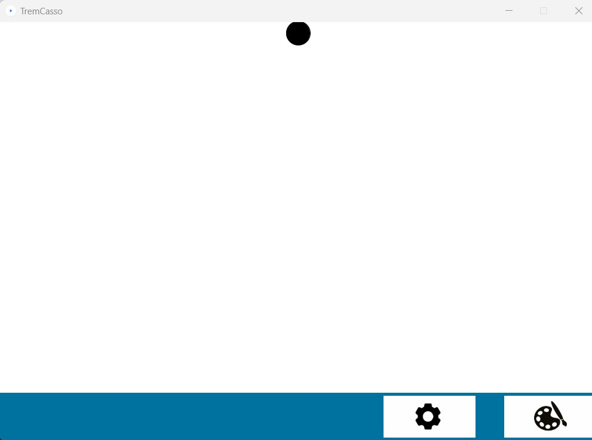
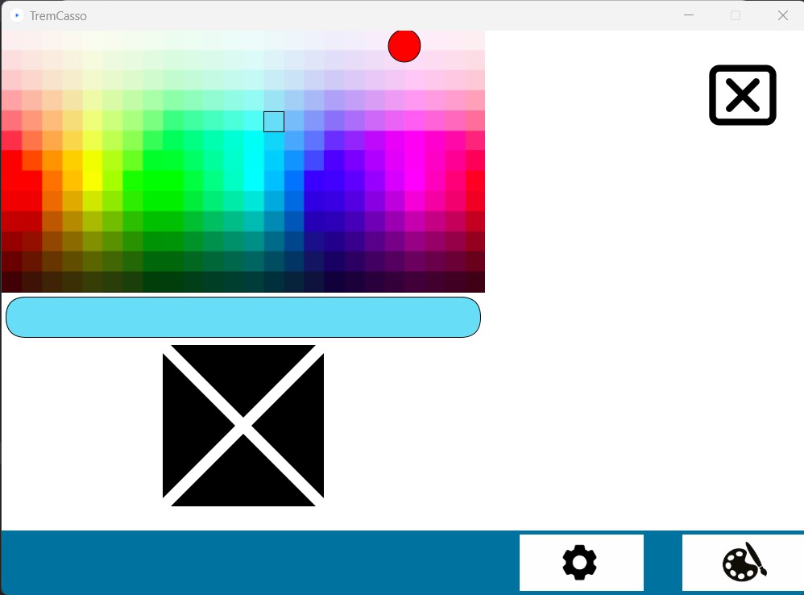
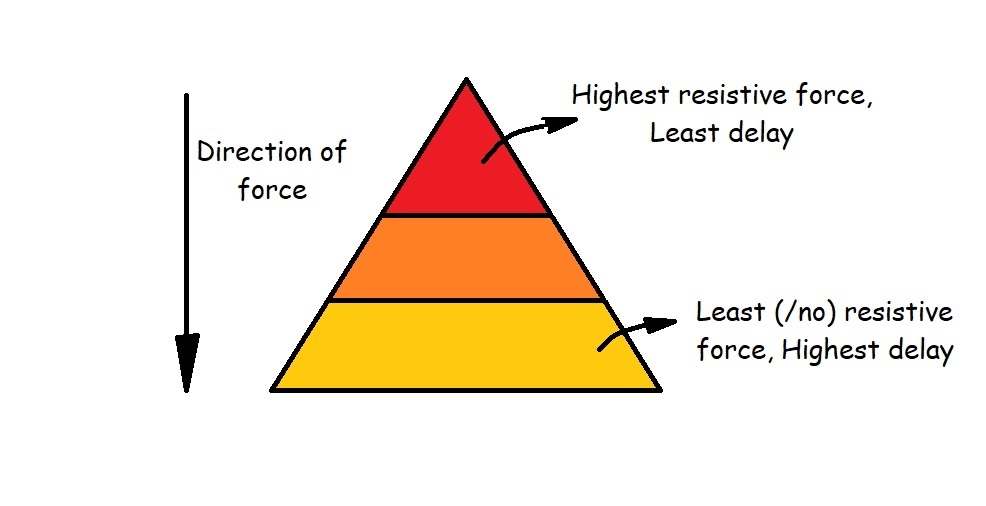

## Introduction
For the first iteration of our project TremCasso, my team and I started with a brief literature survey to inform our design choices to suite our target population i.e. people with tremors. We then decided to individually implement different concepts for the Colour Picker required for the drawing tool. We had initially intended to analyze the various resulting designs with the aim to converge our concepts into a better final product. However, following our review session with the mentors the better plan of action seemed to be to try to refine the individual designs further and get expert advice on the interface.

In this blog, I will go a little more into our experience, the literature survey and the reasoning behind my design choices for the Colour Picker and my process developing it.

## Takeaways from the Literature Survey 
Owing to the commercially available adaptive tools like weighted pens for people with tremors my initial impression was that weighing down the hand movement would help to damp the tremors and make the UI more accessible. However, literature revealed that this wasn't necessarily ideal and that the pointer must instead be easy to move and less sensitive to small movements. The study also found that easy to reach buttons to reduce fatigue and design to facilitate holding the pointer in position during clicking were other desireable attributes for the said target population[1]. 
Larger buttons and adequate spacing between neighbouring buttons are other techniques used to minimize accidental activation of buttons[2]. Further, using techniques like sliding rather than clicking and introducing delay in clicks are other design modifications that have been proposed to make the UI more suitable for the target population[3][4].

## Designing the Colour Picker and the overall UI
The initial version of the UI consisted of 2 functional screens,
1. The Canvas- where the user could draw with the selected colour
2. The Colour Picker- to select the colour
and a menu bar at the bottom allowing the user to navigate to the colour picker and settings page.

### 1. The Canvas

Inorder to simulate the effect of a weighted pen which is a common adaptive instrument used by people with tremors, a damping effect has been applied to the end effector while in the canvas.

I created a separate Java class for the coloring feature of the canvas as I was hoping to make it as modular and reusable as possible. It works by drawing a circle of the specified radius and colour onto the PGraphics object at the position of the end effector. 

    canvas.beginDraw();
    canvas.noStroke();
    canvas.fill(color(r,g,b));
    if (drawingMode){
    canvas.circle(Math.round(x), Math.round(y), rad);
    }
    canvas.endDraw();

<video height="100%" controls>
  <source src="../assets/images/project/iteration1/canvas.mp4" type="video/mp4">
</video>

### 2. The Colour Picker

#### V0.1
The colour picker consisted of a palette of colours, a display of the selected colour, and buttons to manipulate the position of the colour selector.

The color selector was designed to move in the direction of the button where the end effector rested. These buttons were large to make it easy to position the end effector at the desired target and closely placed to reduce fatigue caused by large movements. Also, the colour selector was designed with a wrap-around feature (for example, it appeared at the first column left side if the right direction button is pressed when it is at the last column on the right). 

    public int[] up(){
        if (this.pointer[1]-this.position[1]>0){
            this.pointer[1]-=25;
        }
        else
          this.pointer[1]=300;
        return this.pointer;   
    }

    ...
    ...
    ...

    public void draw(PGraphics g) 
    {
      g.image(this.palette, this.position[0], this.position[1]);
      g.noFill();
      g.square(this.pointer[0],this.pointer[1],25);
      getColour(g);
      g.fill(g.red(this.colour), g.green(this.colour), g.blue(this.colour));
      g.rect(this.position[0]+5, this.position[1]+330, 589, 50, 28);
      
    }

To reduce the risk of accidentally trigerring neighbouring buttons a damping effect has been applied to the area between the buttons. Further, a delay has been applied to the triggering the buttons when the end effector rests on them to avoid accidental triggering. 

    if (s.h_avatar.isTouchingBody(up)){
      if (checkDelay(0))
        cp.up();
    }

    ...
    ...
    ...

    public boolean checkDelay(int index){
    if (millis()-counters[index]>delay){
        counters= new float[]{millis(), millis(), millis(), millis()};
        click=true;
        return true;
    }
    else
        return false;
    }

Each of the buttons have also been assigned a hotkey: W for up, S for down, A for left and D for right respectively. 

Haptic effects somewhat resembling the feeling when a button is pushed are also applied to the end effector at each click. This was done by introducing a small force in the vertical direction. 

    public void YforceSetter(){
        if (click){
            count++;
            if (count==10)
            {
            click=false;
            count=0;
            }
            f_ee.set(f_ee.x, f_ee.y+2.5);
        }
    }

<video height="100%" controls>
  <source src="../assets/images/project/iteration1/colourPicker_v01.mp4" type="video/mp4">
</video>

#### V0.2
During one of the feedback sessions it became apparent that one of the disadvantages of the current design concept was the long time it took to navigate from one colour to another. Even considering that the delay would be eventually configurable to the desired level, if had to still be retained at a high enpugh level to avoid accidental triggering, it meant a significant wait time to get to the desired colour if they are far apart.

To try to alleviate this, I decided to try out a slightly nuanced implementation of the first version based on some of the feedback and ideas that came up during the meeting with the mentors and TAs. One of the ideas that was discussed was to make it harder to enter or trigger something thereby avoiding accidental triggers and ensure that a triggering was intentional.

Playing on this idea, I implemented the button with a gradient of delay- i.e. the delay would depend on the position of the end effector on the large button. A force gradient was also applied on the button so that intentionally pushing further in with greater force causes the colour selector to move faster. The gradient that has been implemented in this prototype has three discrete levels and can be illustrated for the 'down' button as shown below.

    if (s.h_avatar.getY()<positions[1]+3.5)
    {
        delayGrad=500;
        buttonForces=2;
    }
    else if (s.h_avatar.getY()<positions[1]+4.25)
    {
        delayGrad=1500;
        buttonForces=1;
    }
    else
    {
        buttonForces=0;
        delayGrad=3000;
    }
    
Therefore with this design the user can intentionally push harder to make the colour picker move faster while still avoiding accidental triggering owing to tremor since the delay is higher at the easily accessible portions of the button. For this version, I removed the damping effect of the area between the buttons and replaced it with a hard invisible wall since the damping effect was interfering with the resistive forces.

I also has to tweak the click haptics described earlier and make it act in the horizontal direction since this could no longer be felt when the resistive force was also acting in the vertical direction.

Rather than implement this over the entire UI, for now, I have only roughly implemented this on the down button so as to be able to test and demonstrate the concept. I've set the button colour to gray rather than black in the UI to highlight this change. Everything else mentioned above ([V0.1](#v01)) was retained as is.

<video height="100%" controls>
  <source src="../assets/images/project/iteration1/colourPicker_v02.mp4" type="video/mp4">
</video>

### Other features
The Spacebar has been configured as a disable/enable toggle key throughout the UI, disabling/enabling the drawing and the colour selecter buttons on the canvas and colour picker respectively when pressed, so that user could avoid making errors if they ever felt fatigued, out of control or simply wanted to navigate freely through the application without accidentally painting over the canvas or changing colour selection.

The settings button currently leads to a placeholder. This page is intended to contain application settings like click delay, damping etc. and was only placed in this iteration to demonstrate how an invisible wall separating the 2 buttons (settings and palette) could help to avoid accidentally triggering the wrong button.

The functionality of the disable in the colour picker and the canvas has been demonstrated in the video below. The video also demonstrates how the invisible wall between the two buttons serves as a separation to avoid accidental trigerring.

<video height="100%" controls>
  <source src="../assets/images/project/iteration1/otherFeatures.mp4" type="video/mp4">
</video>

## Summary and Reflections
I thought this iteration was fairly successful in that we managed to get 3 quite different colour picker concepts out of it. Although I was initially a little worried about how implementing the same thing in different ways would affect the overall progress of the project. However, this approach made it possible to give each other feedback/ suggestions within the team from a third person perspective, explore and brainstorm a lot of different ideas, and has put us in a much better position to receive expert advice on our varied concepts. Besides, we still managed to implement a bare minimum colouring tool which is a fair bit of progress!

For the next iteration, we are hoping to get some expert advice on our concepts and tweak the colour picker design accordingly. Besides just refining the colour picker, there are many other aspects to our project such as trying out the haptic effects on the canvas (such as walls on outlines of a picture) and end effector modifications which I'd be excited to explore.

## References
[1] Begnum, Miriam. (2010). Improving Computer Interaction for People with Parkinson's Disease. \
[2] Hagen, Simen & Sandnes, Frode. (2010). Toward accessible self-service kiosks through intelligent user interfaces. Personal and Ubiquitous Computing. 14. 715-721. 10.1007/s00779-010-0286-8. \
[3] Wacharamanotham, Chat & Hurtmanns, Jan & Mertens, Alexander & Kronenbuerger, Martin & Schlick, Christopher & Borchers, Jan. (2011). Evaluating swabbing: A touchscreen input method for elderly users with tremor. Conference on Human Factors in Computing Systems - Proceedings. 623-626. 10.1145/1978942.1979031.\
[4] Khan, Muhammad & Ahsan, Kamran & Hussain, Muhammad. (2017). Time Based Intelligent Touch User Interface for Hand Tremor User in Self-service Kiosk. Journal of Huazhong University of Science and Technology. V. 115-125. 

