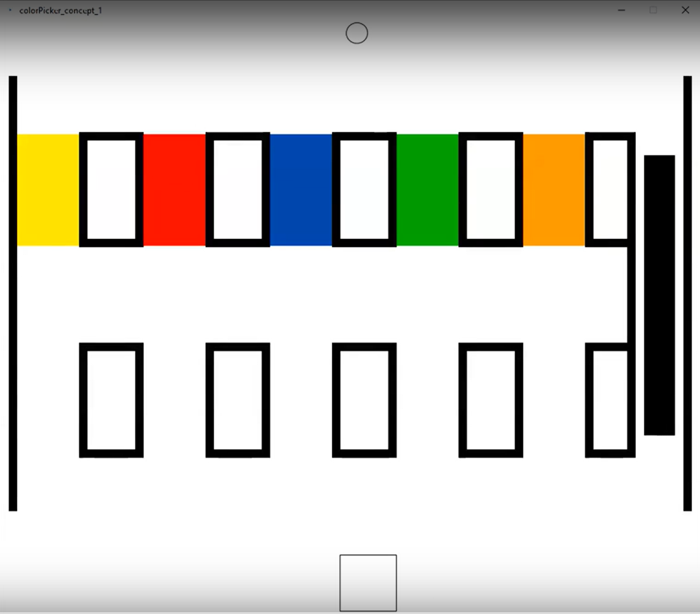

## Project Overview 
Drawing/colouring is generally considered a means of artistic expression or a way to relieve stress. However, for an individual with tremors, having to deal with adapting to physical tools or UIs that are designed with the general population in mind can make it a frustrating process and take away from the joy of something that is otherwise basic and simple. We hope to address the needs of this user population and make practicing art more fun for them through our project TremCasso- an accessible drawing/colouring tool for people with motor skill impairments caused by hand tremors.

## Overview of Iteration 1
For the first iteration, my team and I started with a brief literature survey to inform our design choices to suit our target population. We then decided to individually implement different concepts for the Colour Picker required for the drawing tool. The details of the Colour Picker concept I developed can be found on my [previous blog](https://venissacarolquadros.github.io/CanHap501/project/Iteration1.html)

## On to Iteration 2...
During this iteration, my team and I worked on combining the concepts we'd developed in the previous iteration while majorly focusing on one of them. Prof. Cooperstock introduced us to Prof. Philippe Archambault, who gave us some insight that guided the focus of this iteration. The major takeaways from the discussion were to include customizability in our application since there was wide variability not just in the types of tremors or the severity of the condition in individuals but also for a single individual depending on the time of the day (for example, the time since medication, fatigue levels etc.). Further, it seemed logical to include customizability since we aren't conducting user testing, if we were to avoid having to make too many assumptions about what would be most suitable during the design process. 

Since Yaman's concept allowed for a fair bit of customization and had many variations we could readily explore we decided to adopt that as our base concept and build on it further. 

We started by brainstorming what variables would be best to make customizable for the target population. The various aspects we considered included the orientation of the colour picker, size of the colour picker screen, number of rows and swatches per row, number of stages in the colour picker, and the force feedback of the buttons in the application. We tried to decide which variables to focus on based on what would be most valuable for the target population.  We decided to not focus on orientation as one of the points that came up during our meeting with Prof. Archambault was that while tremors could occasionally be directional there were also some ergonomic considerations here. We also chose to make the colour picker span the full size while still allowing for some customizability of the colour picker size. 

In order to make more colours available even with the limited number of swatches, each swatch was made into a gradient of colours (instead of a single colour) thus making it possible to select the desired colour by going through multiple stages. Further, we included pagination in our application making it possible to switch between the canvas (where the user can draw) and the colour picker and also navigate to stages in the colour picker. 

Antoine and Yaman worked majorly on the colour picker, while I worked on the pagination and the canvas (which I had built in the last iteration) and also the buttons and their haptics needed to enable navigation within the application. 

## Development for Iteration 2
### Pagination
I had already implemented pagination for my concept in the previous iteration and so while I had a rough idea of where to start, the implementation in this iteration came with a different set of challenges. This code base was completely different and so I started by restructuring and organizing the code base so that everyone could continue working without necessarily breaking or having too much trouble because of the multiple pages.  

Since my implementation of pagination works by hiding the bodies that weren't needed for a page, this also required that I knew which bodies had to be hidden. Given that the only objects that needed to be retained throughout the application were the side button and its other components I implemented this by setting a tag to these elements and hiding and or showing the rest as needed.

    for (FBody b: bodies) { 
        if (b.getName()!= "reserved") {
            if (b.getName() == "swatchSpacer") {
                b.setSensor(false);
                b.setFillColor(color(255,255,255));
                b.setStrokeWeight(12);
                b.setStrokeColor(color(0,0,0));
            }
            else if (b.getName()=="semireserved"){
              b.setSensor(true);
            }
            else{

                b.setSensor(false);
                b.setFill(0);
            }
        }
    }

I reused the Coloring class I had created in the previous iteration for the drawing canvas. It allows the user to colour on the canvas with the selected colour and also enables and disables the colouring by pressing Spacebar.

Since Yaman and Antoine were implementing the colour picker page, I then moved on to the GUI buttons which would allow the user to navigate to the pages. 

### Buttons
During our design discussions for the buttons, we concluded that buttons should ideally be aligned to and span the entire wall so that the user does not have trouble reaching the target. Also, a single button was to serve as both the entrance to and exit from the colour picker. This would make the UI cleaner and limit the number of buttons present at any instant. Accordingly, I implemented a button along the right wall to allow the user to enter the colour picker from the canvas and then exit back into the canvas after selecting the colour. 

To allow for reliable triggering and make the visual state of the button reflect what action it caused, I placed a boundary a little to the left of the button. The flow for this works as follows:
1. The user touches the button with the end effector to trigger the button and page changes. Resting on the button or moving very slightly in and out of the button (which could be caused by tremors) does not result in cycling between pages. This is indicated by the button image remaining the same before and after the triggering.
2. When the page has changed and the user moves into the new page (crossing the boundary mentioned earlier), the visual of the button changes indicating the button can now be triggered to move out of the page.

        boolean pageChange= false;

        . 
        .
        .

        if (s.h_avatar.isTouchingBody(paint)){
            if (page==0 && !pageChange)
            {
                page=1;
                pageChange=true;
            }
            if (page==1 && !pageChange)
            {
                page=0;
                pageChange=true;
            }
        }

        if (s.h_avatar.isTouchingBody(boundary)){
            pageChange=false;
        }

The boundary position was adjusted to be far enough to avoid accidental cyclic movement and at the same time close enough to not require the user to move too much to reenable the button. 

In the case of the previous and next buttons within the colour picker, while they were initially implemented separately (at the top and bottom of the page) following further discussions these buttons were also combined to form a single button at the bottom of the screen. A similar logic was used to implement this.

Even with the boundary, there was still the possibility of a user from the target population moving sufficiently out of the button and triggering it repeatedly resulting in cycling between the pages. To alleviate this concern and to make the interface seem more interactive haptic effects were introduced into the buttons.

<video height="100%" controls>
  <source src="../assets/images/project/iteration2/button_logic.mp4" type="video/mp4">
</video>

### Haptics for buttons
The feedback force for the buttons was implemented in the form of a gradient, that is, the force progressively increased as the user moved further into the button similar to the effect of pressing a spring. The function that implements this can be found in the Buttons java class.

    public PVector applyForces(float forceMin, float forceMax, float pos, PVector fEE){
        if (pos>= buttonMin && pos <= buttonMax){
            float increments= (forceMax- forceMin)/ (float)(this.buttonMax -this.buttonMin);
            float force= (pos-buttonMin)* increments;
            if (orientation=='h')
                fEE.set(fEE.x+force, fEE.y);
            if (orientation=='v')
                fEE.set(fEE.x, fEE.y+force);
        }
        return fEE;
    }

While the implementation of the forces themselves was fairly straightforward it took much longer to tweak the positions and the force values so that the effect felt as desired. The challenges in tuning the position and the force values were further exacerbated by Haply's varied behaviour over its workspace (especially at the borders of the workspace).

<video height="100%" controls>
  <source src="../assets/images/project/iteration2/pagination.mp4" type="video/mp4">
</video>

### Visual feedback coordination
During our meeting with the mentors and TAs, the lack of visual feedback coordination between the application behaviour and the haptics became glaringly apparent. Admittedly, I was still only focusing on getting the functionality right and had not sufficiently focused on the visuals, however, there were aspects I would have overlooked if not for the points raised during this meeting. 

Besides making the buttons appear to span the whole length of the screen (which hadn't been done yet, as can be observed in the video in the previous section) to make this affordance clearer, I also worked on changing the icons of the buttons since this didn't seem to be as obvious as expected. Also, since the way to trigger a button in our application (which is by touching or hovering over the button) isn't quite conventional, and the lack of haptics involved when the trigger happens, it made it necessary to use visual reinforcement to convey this. One more point that was brought up was to achieve coordination between the visual and haptic modalities since the gradient force was already present.

To address the latter two concerns the button visual feedback was modified to appear like it was a button being pushed into the wall, which made it give the illusion of an actual push button. This was done by modifying the position of the button to move when the end effector was in contact with it. 

When I was done, while I'd changed the button icons to be more clear, the design was still pretty bland. Antoine worked on the button images to give a polished, cool look to the buttons!

<video height="100%" controls>
  <source src="../assets/images/project/iteration2/button_logic_new.mp4" type="video/mp4">
</video>

### Further modifications
After making all the above-mentioned changes, during one of our discussions, the topic of only triggering the button when it is fully pushed came up. This made sense to me since even with physical buttons the triggering usually happens only when the button is pushed all the way. Further, by implementing this, while it made the button only a slight bit harder to trigger (that is, the user would need to push the end effector to the end of the workspace to trigger the button) it also helped to reduce accidental triggers. Further, since pushing to edges is generally considered easy (according to Fitts' law) the added difficulty might not even be as significant and perhaps the user would have pushed to the edge for convenience even if the triggering was set midway. And so, I implemented this on both buttons.

We also had a long back-and-forth on the best layout for the previous/next buttons. We finally settled on making the button the width of the colour picker. The wall of the button  

One more thing we wanted to try out was making the haptic effect of a click when the button was triggered. I initially thought this would be easy since I had implemented a similar effect for my buttons in the previous iterations. However, (like most things seem to go,) this didn't turn out to be as straightforward as I'd hoped. 
I tried two variations for this:
1. The force gradient implemented earlier was modified so that the force dropped to a lower static value beyond the 'trigger point' so that the drop in force felt like a click.
The challenge with this model was that when the force was set low enough to feel the 'click' effect the end effector occasionally got stuck within the button and did not retain its push-back effect. 
2. The force gradient was kept as is with a small added perpendicular force when the click occurs. While the click is actually in the wrong direction in this case, this isn't necessarily apparent because the resulting movement is small.
While I had success with a similar implementation in the previous iteration I was not able to get a satisfactory effect despite much tweaking. Both these variations can be found [here](https://github.com/VenissaCarolQuadros/TremCasso/blob/it2_VCQ/iteration2/TremCasso_paginated/Buttons.java)

Finally, Antoine modified the force gradient with a variation of the logic in 1. and after some tweaking that gave a better feel. The effect is fairly subtle and there are still rare occasions when the problem of the end effector getting stuck occurs but the effect is now otherwise smooth. 

One of the reasons I believe the renderings didn't quite work as expected is because of Haply's limitations in rendering force reliable at the far corners of the workspace. More on that in the next section...

But before we go there, do catch a glimpse of what the final implementation at this stage looks like:

<video height="100%" controls>
  <source src="../assets/images/project/iteration2/final.mp4" type="video/mp4">
</video>

### Challenges and Haply quirks
In this iteration, since we were simultaneously working on the same code it took an extra bit of effort to ensure that we weren't sabotaging each other's work and also to make sure everyone was in the know about any changes we made so that they could continue to work comfortably. This slowed the progress down a bit initially but once got the hang of it, it didn't seem much of a hassle anymore. On the contrary, it often gave the added advantage of instant feedback/ alternate suggestions on implementing something. 

One Haply quirk that bothered me a bit during this iteration was the unevenness of the force rendered at different parts of the workspace. While I had noted this while doing the PID lab, this time there wasn't the possibility of simply shifting the rendering into a favourable part of the workspace and losing the entire top portion. The force rendering on the other edges (while sometimes not the best) still worked better than the top portion close to the motors. By modifying the layout of our application so that we wouldn't need to be rendering any forces at the top we were able to evade most of the complications this caused.

You can find the code for this iteration here: [TremCasso Iteration 2](https://github.com/VenissaCarolQuadros/TremCasso/tree/main/iteration2/TremCasso_paginated)

## Reflections
Working on the same prototype simultaneously came with its own set of problems, however, it had many advantages. Since we were all working on the same application, bugs were caught fairly quickly, and there was a lot more design planning and discussion. While this meant multiple minor iterations and repeated modifications, it also helped us to catch logic flaws or oversights early on and find solutions to them.

One major learning for me personally was the importance of multiple modalities complimenting or reinforcing each other and also thinking of functionality and experience together. Despite having read about this ad nauseam, heading into the haptics implementation for this iteration I thought of it as a 'functionality' with its sole purpose being to avoid false triggering. I hadn't thought about tying the haptic effects with the interaction experience as much as I should have. This iteration, however, helped me understand how functionality and experience can be tied together. Safe to say, I like the final result a lot more than the one from before.

While there was quite a bit of development in this iteration there are still a couple of things such as introducing features like delay, improving the visual design etc. that could help further improve the design. For the last iteration, we are planning on possibly including more customization, working to improve the haptics and allowing the user to modify the settings within the application.
